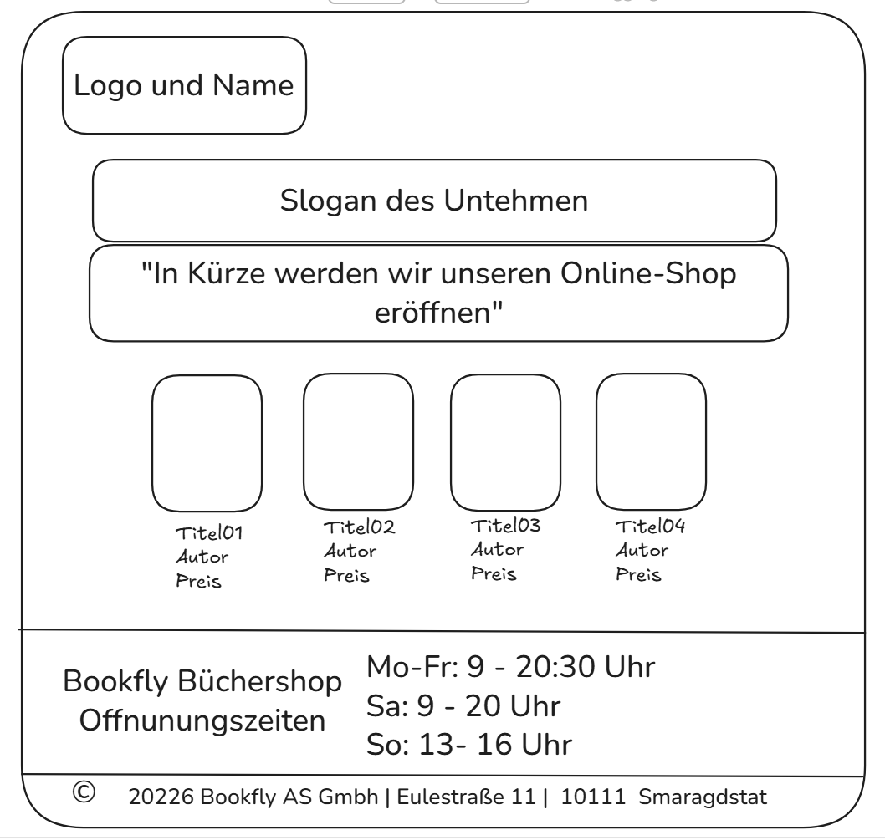

# E-01 · Startseite(Home)

## US-001 Offnungzeiten

**Als** Kunde 
**möchte ich**  die Öffnungs- und Schließzeiten einsehen können.
**um**  zu wissen, wann ich das Geschäft besuchen kann.

### Akzeptanzkriterien
- Die Öffnungszeiten müssen von Montag bis Sonntag angezeigt werden.
- Für jeden Tag sind die Öffnungs- und Schließzeiten anzugeben oder, falls zutreffend, das Wort „geschlossen“.
- Die Informationen müssen in Tabellenform dargestellt werden, wobei jeder Tag eine Zeile bildet.
- Die Informationen werden in der Fußzeile angezeigt.

---
## US-002 Identität

**Als** Kunde 
**möchte ich** möchte ich die Identität des Unternehmens anhand des Namens und des Logos eindeutig erkennen können,
**um**  sicher zu sein, dass ich auf der richtigen Website bin.

### Akzeptanzkriterien
- Das Logo und der Name des Unternehmens sind oben links zu sehen und leicht zu erkennen.

### Technische Hinweise / Abhängigkeiten
- Das Logo und der Name werden als JPG-Bild vorliegen.

---
## US-003 Wertversprechen

**Als**  Kunde 
**möchte ich** verstehen, was mir das Unternehmen durch sein Wertversprechen biete
**um**  herauszufinden, warum ich mich für euch entscheiden sollte.

### Akzeptanzkriterien
- Der Slogan des Unternehmens „Dein Geist reist mit den besten Büchern – wir sind deine Brücke“ ist unterhalb des Logos gut zu erkennen.
- Unterhalb des Slogans wird die baldige Eröffnung des Online-Shops angekündigt.

---

## US-004 Hauptangebote

**Als** Kunde  
**möchte ich** möchte ich die wichtigsten Produkte des Shops leicht erkennen können,
**um** um mir ein Bild davon zu machen, inwieweit sie meinen Bedürfnissen entsprechen.

### Akzeptanzkriterien
- Die vier ausgewählten Bücher werden ausgestellt
- Von jedem Buch werden ein Bild, der Titel, der Autor und der Preis angezeigt. 
- Bei großer Bildschirmgröße werden die vier Bücher in einer einzigen Zeile angezeigt, bei mittlerer Bildschirmgröße in zwei Zeilen und zwei Spalten und bei kleiner Bildschirmgröße in einer Spalte.

---

