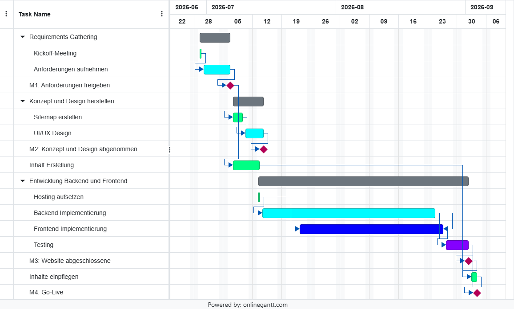

# Gantt Diagramm mit Meilenstein
-----
| Meilenstein | Description | Vorherige Vorgänge im Netzplan | bisherige Gesamtstunden |
|---|---|---|---|
| M1 — Anforderungen freigeben | Anforderungen sind mit dem Auftraggeber abgestimmt und dokumentiert | A + B | 6h |
| M2 — Konzept und Design abgenommen | Sitemap, UI/UX-Design stehen | + C + D | 12h |
| M3 — Website abgeschlossen | Hosting-Umgebung, Frontend und Backend sind vollständig implementiert und integriert | + E + F + G | 73h |
| M4 — Projektabnahme durch den Kunden | System getestet, Inhalte final eingepflegt, System live | + H + I + J | 80h |

