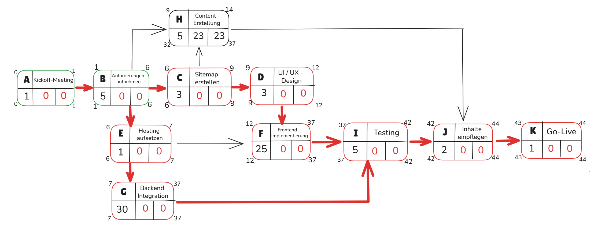

# Netzplan

## Vorgangstabelle

| Vorgang | Aufgabe                    | Dauer (Tage) | Vorgänger |
|---------|-----------------------------|---------------|-----------|
| A       | Kickoff-Meeting             | 1             |           |
| B       | Anforderungen aufnehmen     | 5             | A         |
| C       | Sitemap erstellen           | 3             | B         |
| D       | UI / UX - Design            | 3             | C         |
| E       | Hosting aufsetzen           | 1             | B         |
| F       | Frontend - Implementierung  | 25            | D, E      |
| G       | Backend Integration         | 30            | E         |
| H       | Content-Erstellung          | 5             | C, B      |
| I       | Testing                     | 5             | F, G, H   |
| J       | Inhalte einpflegen          | 2             | I         |
| K       | Go-Live                     | 1             | J         |
|         |                             | **80**        |           |

## Diagramm

